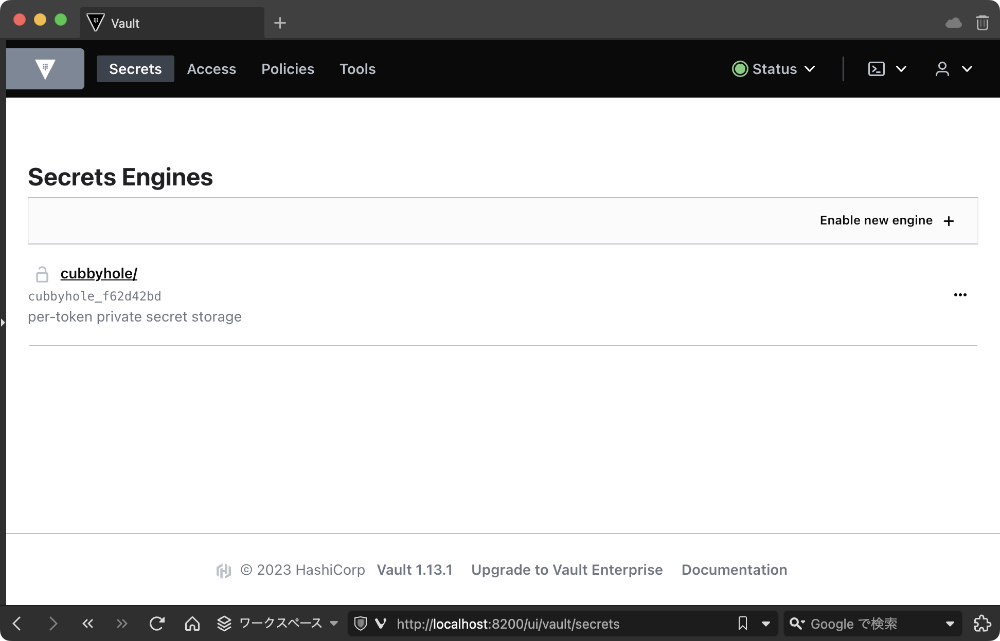

---
head:
  - - meta
    - name: twitter:card
      content: summary
  - - meta
    - property: og:site_name
      content: This Week in Gorilla
  - - meta
    - property: og:title
      content: おうちk8sクラスタにVaultを構築する
  - - meta
    - property: og:url
      content: https://skanehira.github.io/this-week-in-gorilla/docs/2023/0503.html

date: 2023-06-09
outline: deep

---

# おうちk8sクラスタにVaultを構築する

普段GitHubのSSHの鍵やPATなどをいつも手動で管理、設定をしていた。
手動で発行するだけならまだしも、PATなどのローテーションはできれば自動化しておきたい。

ちょうど最近おうちk8sクラスタを組んだので、せっかくだしHashCorp Vaultをk8sに載せてもう少しセキュアに機密情報を管理したい。
ということで実際にVaultをk8s上に構築してみた。

## k8sクラスタ構成

| ホスト名 | OS                        | 役割                 |
|----------|---------------------------|----------------------|
| pi1      | Ubuntu Server 22.04.2 LTS | コントロールプレーン |
| pi2      | 同上                      | ワーカー1            |
| pi3      | 同上                      | ワーカー2            |
| pi3      | 同上                      | ワーカー3            |

## 前提知識
`Helm`や`Vault`は雰囲気でしか知らないので、以下の資料などを読んでキャッチアップした。

- [Helm](https://helm.sh/ja/)
- [Vaultに格納したシークレットをKubernetesから活用する方法](https://www.youtube.com/watch?v=b2iiZ16eI7A)
- [Vault Agent with Kubernetes](https://developer.hashicorp.com/vault/tutorials/kubernetes/agent-kubernetes)

`Vault`に関してはこの図はわかりやすかった。


## ストレージの構築
`Vault`をk8sで動かす際にPVCが必要なので、それ用のストレージをpi1に構築していく。
今回は以下の情報を参考した。

- https://www.server-world.info/query?os=Ubuntu_20.04&p=nfs&f=1
- https://www.server-world.info/query?os=Ubuntu_20.04&p=kubernetes&f=6
- https://linuxjm.osdn.jp/html/nfs-server/man5/exports.5.html

```sh
# NFSをインストール
root@pi1:~# apt -y install nfs-kernel-server

# Domain を pi1 に変更する
root@pi1:~# vim /etc/idmapd.conf
root@pi1:~# cat /etc/idmapd.conf
[General]

Verbosity = 0
# set your own domain here, if it differs from FQDN minus hostname
Domain = pi1

[Mapping]

Nobody-User = nobody
Nobody-Group = nogroup

# 公開用のディレクトリを作成
root@pi1:~# mkdir -p /home/nfsshare/vault
root@pi1:~# chown -R nobody:nogroup /home/nfsshare

# 最終行にマウント設定を追加
root@pi1:~# vim /etc/exports
root@pi1:~# cat /etc/exports
# /etc/exports: the access control list for filesystems which may be exported
#               to NFS clients.  See exports(5).
#
# Example for NFSv2 and NFSv3:
# /srv/homes       hostname1(rw,sync,no_subtree_check) hostname2(ro,sync,no_subtree_check)
#
# Example for NFSv4:
# /srv/nfs4        gss/krb5i(rw,sync,fsid=0,crossmnt,no_subtree_check)
# /srv/nfs4/homes  gss/krb5i(rw,sync,no_subtree_check)
/home/nfsshare 192.168.1.0/24(rw,sync,all_squash,no_subtree_check)

root@pi1:~# systemctl restart nfs-server
```

試しにpi1にファイルを作成して、pi2からmountして動作確認してみる。

```sh
root@pi1:~# echo "hello" > /home/nfsshare/hello.txt
root@pi1:~# cat /home/nfsshare/hello.txt
hello
```

```sh
# `nfs-common`を入れないと以下のエラーが発生する
# 他のノードにも同様に`nfs-common`をインストールしておく必要がある
# mount: /mnt/pi1: bad option; for several filesystems (e.g. nfs, cifs) you might need a /sbin/mount.<type> helper program.
root@pi2:~# apt install nfs-common
root@pi2:~# mkdir /mnt/pi1
root@pi2:~# mount -t nfs pi1:/home/nfsshare /mnt/pi1
root@pi2:~# cat /mnt/pi1/hello.txt
hello

# 動いたのでアンマウントしておく
root@pi2:~# umount /mnt/pi1
```

以下のマニフェストを作ってPVを作成する。なお、参考した記事にはないが`storageClassName`が必要のようなのでそれを追記した。

```yaml
apiVersion: v1
kind: PersistentVolume
metadata:
  name: vault
spec:
  capacity:
    storage: 10Gi
  accessModes:
    - ReadWriteOnce
  persistentVolumeReclaimPolicy: Retain
  storageClassName: slow
  nfs:
    path: /home/nfsshare/vault
    server: 192.168.1.1
    readOnly: false
```

```sh
root@pi1:~# kubectl apply -f nfs-pv.yaml
persistentvolume/vault created
root@pi1:~# kubectl get pv
NAME    CAPACITY   ACCESS MODES   RECLAIM POLICY   STATUS      CLAIM   STORAGECLASS   REASON   AGE
vault   10Gi       RWO            Retain           Available           slow                    10s
```

## Vaultの構築
以下のドキュメントを参考に構築していく。

- [Vault on Kubernetes Deployment Guide](https://developer.hashicorp.com/vault/tutorials/kubernetes/kubernetes-raft-deployment-guide)
- [Hashicorp Vault Part 2- Deploy Vault on Kubernetes](https://medium.com/@tanmayvarade/hashicorp-vault-part-2-deploy-vault-on-kubernetes-edb049301d1)

### `Vault`のnamespaceを作る。

```sh
root@pi1:~# kubectl create namespace vault
namespace/vault created
```

### Helmのインストール

[公式ドキュメント](https://helm.sh/ja/docs/intro/install/#apt-%E3%81%8B%E3%82%89-debianubuntu)を参照してhelmをインストールする。

```sh
root@pi1:~# curl https://baltocdn.com/helm/signing.asc | gpg --dearmor | sudo tee /usr/share/keyrings/helm.gpg > /dev/null
root@pi1:~# apt install apt-transport-https --yes
root@pi1:~# echo "deb [arch=$(dpkg --print-architecture) signed-by=/usr/share/keyrings/helm.gpg] https://baltocdn.com/helm/stable/debian/ all main" | sudo tee /etc/apt/sources.list.d/helm-stable-debian.list
root@pi1:~# apt update
root@pi1:~# apt install helm
```

### Helm Repoの追加

repoは2つあるけど、今回は`hashicorp/vault`を使う。

```sh
root@pi1:~# helm repo add hashicorp https://helm.releases.hashicorp.com
root@pi1:~# helm search repo hashicorp/vault
NAME                                    CHART VERSION   APP VERSION     DESCRIPTION
hashicorp/vault                         0.24.1          1.13.1          Official HashiCorp Vault Chart
hashicorp/vault-secrets-operator        0.1.0           0.1.0           Official Vault Secrets Operator Chart
```

### Helm Chartの設定
`override-values.yaml`を作って以下の設定を追記する。

```yaml
# injectorは使わないので無効化
injector:
  enabled: false

server:
  dataStorage:
    # 作成したPVの`storageClass`を指定する
    storageClass: slow

ui:
  enabled: true
```

### Vaultをデプロイする
`helm install`を使ってデプロイする。正常に完了する以下のようになる。

```sh
root@pi1:~# helm install vault hashicorp/vault --namespace vault -f override-values.yaml
NAME: vault
LAST DEPLOYED: Sun Jun 18 23:55:33 2023
NAMESPACE: vault
STATUS: deployed
REVISION: 1
NOTES:
Thank you for installing HashiCorp Vault!

Now that you have deployed Vault, you should look over the docs on using
Vault with Kubernetes available here:

https://www.vaultproject.io/docs/


Your release is named vault. To learn more about the release, try:

  $ helm status vault
  $ helm get manifest vault
```

念のため、デプロイされているのを確認する。

```sh
root@pi1:~# helm list --namespace vault
NAME    NAMESPACE       REVISION        UPDATED                                 STATUS          CHART          APP VERSION
vault   vault           1               2023-06-18 23:55:33.09130381 +0900 JST  deployed        vault-0.24.1   1.13.1
```

Podを確認する。

```sh
root@pi1:~# k get pods -n vault
NAME                                    READY   STATUS    RESTARTS   AGE
vault-0                                 0/1     Pending   0          82s
```

::: info valuesの更新

`override-values.yaml`を変更してupgradeするときは以下のコマンドを実行する。

```sh
root@pi1:~# helm upgrade vault hashicorp/vault --namespace vault -f override-values.yaml
```


:::

## Vaultの初期化
`Unseal key`と`Root Token`が出力されるのでそれをメモしておく。
`vault operator unseal`を3回実行して、初期化を完了させる。

```sh
root@pi1:~# kubectl exec --stdin=true --tty=true vault-0 -n vault -- vault operator init
Unseal Key 1: aaaaaaaaaa
Unseal Key 2: bbbbbbbbbb
Unseal Key 3: cccccccccc
Unseal Key 4: dddddddddd
Unseal Key 5: eeeeeeeeee

Initial Root Token: XXXXXXXXXXXXXXXXXX

Vault initialized with 5 key shares and a key threshold of 3. Please securely
distribute the key shares printed above. When the Vault is re-sealed,
restarted, or stopped, you must supply at least 3 of these keys to unseal it
before it can start servicing requests.

Vault does not store the generated root key. Without at least 3 keys to
reconstruct the root key, Vault will remain permanently sealed!

It is possible to generate new unseal keys, provided you have a quorum of
existing unseal keys shares. See "vault operator rekey" for more information.
root@pi1:~#
root@pi1:~# kubectl exec --stdin=true --tty=true vault-0 -n vault -- vault operator unseal aaaaaaaaaa
root@pi1:~# kubectl exec --stdin=true --tty=true vault-0 -n vault -- vault operator unseal bbbbbbbbbb
root@pi1:~# kubectl exec --stdin=true --tty=true vault-0 -n vault -- vault operator unseal cccccccccc
```

コマンドを実行すると`Sealed`がfalseになるのを確認。

```sh
Key             Value
---             -----
Seal Type       shamir
Initialized     true
Sealed          false
Total Shares    5
Threshold       3
Version         1.13.1
Build Date      2023-03-23T12:51:35Z
Storage Type    file
Cluster Name    vault-cluster-690a32c4
Cluster ID      e4c8a45a-5d89-8ab0-ac3c-163b6ec60524
HA Enabled      false
```

vaultのUIからログインして動いているかを確認するため`port-forward`する。

```sh
root@pi1:~# kubectl port-forward vault-0 8200:8200 -n vault
Forwarding from 127.0.0.1:8200 -> 8200
Forwarding from [::1]:8200 -> 8200
```

ブラウザで`http://localhost:8200`にアクセスして、先程の`Root Token`を使ってログインして、以下の画面が表示されれば問題なし。




::: warning Unseal key や Root token について

手順に出てきた Unseal key と Root token は以下のドキュメントを読むとわかる

https://developer.hashicorp.com/vault/docs/concepts/seal

ドキュメントのこの文章がすべてを語っているが...

> 要約すると、ほとんどのVaultデータはキーリング内の暗号化キーを使って暗号化され、キーリングはルートキーによって暗号化され、ルートキーは封印解除キーによって暗号化されます。

自分の理解をまとめると以下となる。

- vaultに保存されているデータは暗号キーを使って暗号化されている
- 暗号キーはルートキーという暗号キーで暗号化された状態でキーリングに保存されている
	- キーリングは複数の鍵に分割されたキーのことらしい
- ルートキーはUnseal keyによって暗号化されている
- Unseal keyは分割されたキーで最低3つある
  - これを複数人がそれぞれ保持しておくことでルートキーを簡単に復元できないようにしているのがミソっぽい

要はUnseal keyからルートキーを復号化して、ルートキーから暗号キーを復号化して、暗号キーからデータを復号化して…って流れのようだ。

:::

### Serviceを用意

HelmでインストールしたvaultはServiceがないのでクラスタ外からアクセスできない。
のでNodePortのServiceを用意して、外からアクセスできるようにする。

pi1はVPN内にいるので、最終的には`pi1:30820`にアクセスできるようになる。

```yaml
apiVersion: v1
kind: Service
metadata:
  name: vault-external
spec:
  type: NodePort
  ports:
    - name: http
      protocol: TCP
      port: 8200
      targetPort: 8200
      nodePort: 30820
  selector:
    app.kubernetes.io/name: vault
```

```sh
root@pi1:~# kubectl apply -f vault/service.yaml -n vault
root@pi1:~# kubectl get svc -n vault
NAME             TYPE        CLUSTER-IP       EXTERNAL-IP   PORT(S)             AGE
vault            ClusterIP   10.109.107.142   <none>        8200/TCP,8201/TCP   22h
vault-external   NodePort    10.99.149.155    <none>        8200:30820/TCP      25m
vault-internal   ClusterIP   None             <none>        8200/TCP,8201/TCP   22h
vault-ui         ClusterIP   10.99.173.68     <none>        8200/TCP            22h
```

これでブラウザから http://pi1:30820 にアクセスすればログイン画面が表示される。

## まとめ
とりあえず構築はできた。

あとはvaultがそもそも何ができるのか、何をどう設定すればやりたいことができるのかを触りながら理解していく。

これは別途記事にする予定。

## 参考資料
- [k8sとVaultを組み合わせてシークレットをもっとセキュアに](https://speakerdeck.com/jacopen/k8stovaultwozu-mihe-wasetesikuretutowomotutosekiyuani)
- [事実上の標準ツールとなっているKubernetes向けデプロイツール「Helm」入門](https://knowledge.sakura.ad.jp/23603/)
- [Vault の Agent Sidecar Injector を使う](https://blog.ssrf.in/post/using-vault-agent-sidecar-injector/)
- [KubernetesのAdmission Controllerとは？](https://eng-investor.com/what-is-kubernetes-admission-controller/)
- [Vaultに格納したシークレットをKubernetesから活用する方法](https://www.youtube.com/watch?v=b2iiZ16eI7A)
- [Kubernetesのシークレット管理方法とVaultとの統合方法について整理](https://qiita.com/momotaro98/items/fce2df7bee8990ff6ae6)
- [Hashicorp Vault Part 2- Deploy Vault on Kubernetes](https://medium.com/@tanmayvarade/hashicorp-vault-part-2-deploy-vault-on-kubernetes-edb049301d1)
