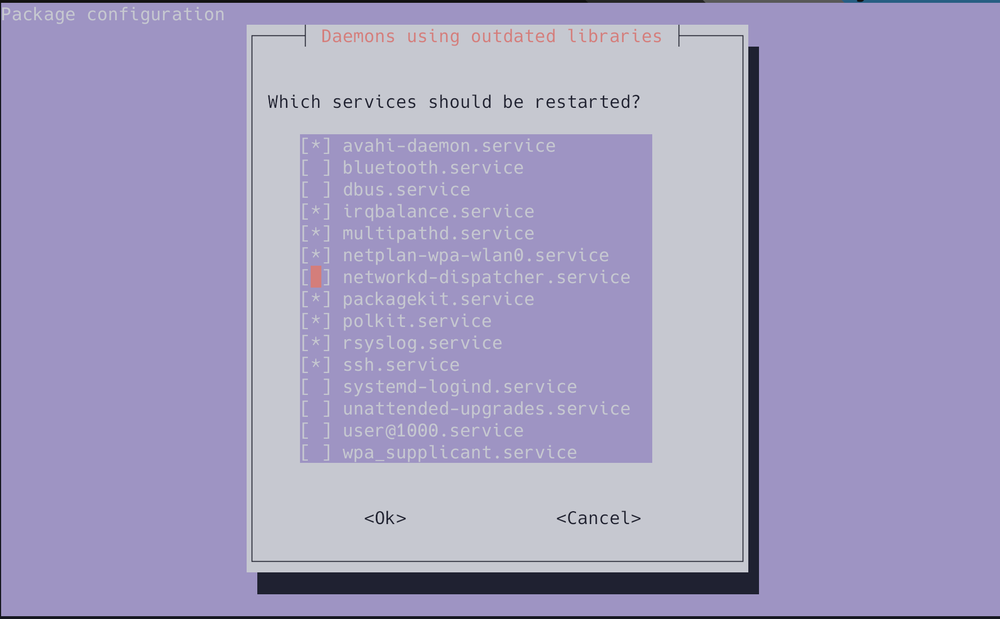
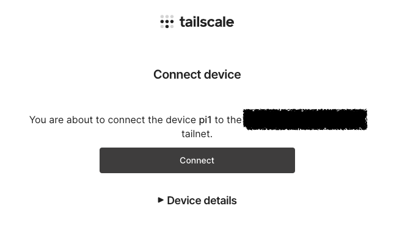

---
head:
  - - meta
    - name: twitter:card
      content: summary_large_image
  - - meta
    - property: og:site_name
      content: This Week in Gorilla
  - - meta
    - property: og:description
      content: 4台のラズパイでk8sクラスタを組んだ
  - - meta
    - property: og:title
      content: 4台のラズパイでk8sクラスタを組んだ
  - - meta
    - property: og:image
      content: https://i.gyazo.com/1d3edeb4078670beb1fac34134577173.png

date: 2023-06-09

---

# 4台のラズパイでk8sクラスタを組んだ
ラズパイでk8sクラスタを組んだのでその記録を残す。  
最終的に出来上がったものはこちら。


## 材料一覧

| 材料                                                                                             | 個数     | 値段       |
|--------------------------------------------------------------------------------------------------|----------|------------|
| [ラズパイ](https://raspberry-pi.ksyic.com/?pdp.id=552)                                           | 4        | 57200      |
| [PoE+ HAT](https://raspberry-pi.ksyic.com/main/index/pdp.id/719)                                 | 4        | 14080      |
| [ラック](https://www.amazon.co.jp/dp/B09S11Q684)                                                 | 1        | 10944      |
| [PoE+ スイッチングハブ](https://www.amazon.co.jp/dp/B08FY4G3FN)                                  | 1        | 5400       |
| [Transcend SSD 240GB 2.5インチ](https://www.amazon.co.jp/dp/B09964C3L5)                          | 1        | 2490       |
| [KIOXIA 内蔵 SSD 240GB 2.5インチ](https://www.amazon.co.jp/dp/B08B39XXMG)                        | 2        | 5960       |
| [エレコム HDMI (メス) - micro HDMI (オス ) 変換アダプタ](https://www.amazon.co.jp/dp/B01017VGR2) | 1        | 690        |
| [LAN](https://www.amazon.co.jp/dp/B07ZTR8HHH)                                                    | 5本入    | 1358       |
| [SATA USB変換アダプター](https://www.amazon.co.jp/dp/B08G8BPPWM)                                 | 4        | 5196       |
| [USBキーボード](https://www.sanwa.co.jp/product/syohin?code=SKB-SL20BK)                          | 1        | 2630       |
|                                                                                                  | **合計** | **105948** |

::: danger ラックについて
今回買ったラックは、なぜかネジを締めるとWIFIが繋がらなくなる事象が発生した。多分金属製だからと思われる。

面白いことに、手をラックの近くに置くとWIFIがつながる。（繋がらない場合もある）
すべてのラズパイがWIFI接続というわけではなくmasterのみなのであんまり影響がないが、本事象は完全に想定外だったのでラック選びは要注意。


:::

## ラックの組み立て
説明書あったが、ネジの種類のラベルが貼っていなくて全然分からなかった。
ので、公式が[動画](https://www.youtube.com/watch?v=IsTBtLj55dU)を出しているのでこちらを参考に組み立てた。

なぜかネジが足りなかったり余ったりしているが、ガタガタしていないので一旦気にしない。


## OSをSSDにインストール
OSは「Ubuntu Server 22.04.2 LTS(64bit)」を使う。


歯車のところからWIFIやssh、キーボードレイアウトなど設定をよしなにやる。


## Mac側の接続設定
- `/etc/hosts`にpi1の設定を追加する
- `-local`にしているのはあとからtailscaleを入れるときDNS名がpi1になるため
  ```
  192.168.3.15 pi1-local
  ```
- sshの設定もする、pi2~pi4はWIFIは使わないので`pi1-local`を踏み台に接続する
  ```
  Host pi1-local
    HostName pi1-local
    Port 22
    User skanehira

  Host pi2
    HostName pi2
    Port 22
    User skanehira
    ProxyCommand ssh pi1 -W %h:%p

  Host pi3
    HostName pi3
    Port 22
    User skanehira
    ProxyCommand ssh pi1 -W %h:%p

  Host pi4
    HostName pi4
    Port 22
    User skanehira
    ProxyCommand ssh pi1 -W %h:%p
  ```

## OSの更新

```sh
apt update && apt full-upgrade
```

画面が出てくるのでそのままEnter、終わったら`reboot now`で再起動する。



## ネットワークの構成
- wlan0 はWIFI
- eth0 有線
  - スイッチングハブでpi1~4同士を接続している

| ホスト名 | wlan0 IP     | wlan0 デフォルトGW | eth0 IP     | eth0 デフォルトGW |
|----------|--------------|--------------------|-------------|-------------------|
| mac      | 192.168.3.4  | 192.168.3.1        | -           | -                 |
| pi1      | 192.168.3.15 | 192.168.3.1        | 192.168.1.1 | -                 |
| pi2      | -            | -                  | 192.168.1.2 | 192.168.1.1       |
| pi3      | -            | -                  | 192.168.1.3 | 192.168.1.1       |
| pi4      | -            | -                  | 192.168.1.4 | 192.168.1.1       |

## ネットワーク周りの設定
#### pi1のネットワーク設定
- ネットワーク周りの設定はnetplanが使われている
- 50-cloud-init.yamlはnetplanによって書き戻されることがあるから、別ファイルを用意して編集
- netplanの書式は https://netplan.readthedocs.io/en/stable/netplan-yaml で確認できる

```sh
sudo cp /etc/netplan/50-cloud-init.yaml /etc/netplan/99-network.yaml
```

`/etc/netplan/99-network.yaml` を開いて、次のように設定する。

```yaml
network:
    version: 2
    ethernets:
      eth0:
        dhcp4: false
        addresses:
          - 192.168.1.1/24
        nameservers:
          addresses:
            - 8.8.8.8
```

`/etc/netplan/50-cloud-init.yaml`側にデフォルトゲートウェイがないのでそれを追加。これをしないとeth0からwlan0を通してインターネットに出れない。
ただ、これは書き換わる可能性があるので別ファイルで設定したいが、やり方分からず一旦これで進める。

```yaml
network:
    version: 2
    wifis:
        renderer: networkd
        wlan0:
            access-points:
                XXXXXXXXXX:
                    password: XXXXXXXXXXXXX
            addresses: [192.168.3.15/24]
            # デフォルトゲートウェイを追加
            routes:
              - to: default
                via: 192.168.3.1
            nameservers:
              addresses: [192.168.3.1]
            dhcp6: false
            accept-ra: false
            link-local: []
```

編集したら設定を適用する。

```sh
skanehira@pi1:~$ sudo netplan apply
```

問題なければ`eth0`にIPが表示される。

```sh
skanehira@pi1:~$ ip a
...
2: eth0: <BROADCAST,MULTICAST,UP,LOWER_UP> mtu 1500 qdisc mq state UP group default qlen 1000
    link/ether d8:3a:dd:1e:50:50 brd ff:ff:ff:ff:ff:ff
    inet 192.168.1.1/24 brd 192.168.1.255 scope global eth0
       valid_lft forever preferred_lft forever
    inet6 fe80::da3a:ddff:fe1e:5050/64 scope link
       valid_lft forever preferred_lft forever
...
```

#### pi2~4のネットワーク設定
pi1と同様にeth0の設定をする。

```yaml
network:
    version: 2
    ethernets:
      eth0:
        dhcp4: false
        addresses:
          - 192.168.1.3/24
        routes:
          - to: default
            via: 192.168.1.1
        nameservers:
          addresses:
            - 8.8.8.8
```

`/etc/netplan/50-cloud-init.yaml`のwifis項目をコメントアウトしてWIFIを使えないようにする。

### pi1のNAT化
ipv4のパケット転送を有効化。
これにより`eth0` <-> `wlan0`のパケット転送が有効になる。

```sh
sysctl -w net.ipv4.ip_forward=1 >> /etc/sysctl.conf
```

iptables[^1]の設定をする。

```sh
# 送信元のアドレスを変換する
iptables -t nat -A POSTROUTING -o wlan0 -j MASQUERADE
# wlan0(WIFI) -> eth0(LAN) のパケットは確立済みのものだけを許可する
# -A 新しいルールをチェインに追加
# -i パケットを受信するNIC
# -o パケットを送信するNIC
iptables -A FORWARD -i wlan0 -o eth0 -m state --state RELATED,ESTABLISHED -j ACCEPT
# eth0(LAN) -> wlan(WIFI)のパケットを許可する
iptables -A FORWARD -i eth0 -o wlan0 -j ACCEPT
```

iptablesの設定を永続化する[^3]

```sh
apt install -y iptables-persistent
netfilter-persistent save
```

### ホスト名の設定
- `/etc/hosts`の設定を変更する場合 cloud-init で管理されているため、rebootすると上書きされてしまう[^2]
- ので、hostsを追加したい場合は、以下の`/etc/cloud/templates/hosts.debian.tmpl`を変更する必要がある
- reboot面倒なので、同じ内容を`/etc/hosts`にも追加
- pi1~3ともに設定する必要がある（後にk8sクラスタを作るときに必要なので）

pi1
```
192.168.1.2 pi2
192.168.1.3 pi3
192.168.1.4 pi4
```

pi2
```
192.168.1.1 pi1
192.168.1.3 pi3
192.168.1.4 pi4
```

pi3
```
192.168.1.1 pi1
192.168.1.2 pi2
192.168.1.4 pi4
```

pi4
```
192.168.1.1 pi1
192.168.1.2 pi2
192.168.1.3 pi3
```

## k8sクラスタの構築
k8sクラスタを構築するにあたり、以下の資料を読んでネットワークの雰囲気を掴んだ。

- [整理しながら理解するKubernetesネットワークの仕組み](https://speakerdeck.com/hhiroshell/kubernetes-network-fundamentals-69d5c596-4b7d-43c0-aac8-8b0e5a633fc2)を呼んでまずネットワーク周りを完全理解する。
- [第3回 Kubernetesのネットワーク～クラスタ環境でコンテナネットワークを構築する方法～](https://www.fsi.co.jp/blog/5305/)

今回はkubeadmを使うので、[公式ドキュメント](https://kubernetes.io/ja/docs/setup/production-environment/tools/kubeadm/install-kubeadm/)を読みつつ構築してく。

### 必要なポートが空いているかを確認
[こちら](https://kubernetes.io/ja/docs/reference/networking/ports-and-protocols/)にポート一覧があるので、それらが空いているかを確認する。

### swapの無効化

swapの確認をするとswapが無効になっているので何もしない。

```sh
root@pi1:~# swapon --show
root@pi1:~#
```

### ランタイムのインストール
[こちら](https://kubernetes.io/ja/docs/setup/production-environment/container-runtimes/)を読むと事前にランタイム共通の設定を行う必要があるので、各ノードでそれをやっていく。
今回`containerd`を使う。

#### `linux-modules-extra-raspi`のインストール
[こちら](https://qiita.com/showchan33/items/5250f518eb03858a0c25)を読むと、
`linux-modules-extra-raspi`を入れないとCNI[^4]が正常に動かないらしいので入れておく。

```sh
root@pi1:~# apt install -y linux-modules-extra-raspi
root@pi1:~# reboot now
```

#### カーネルモジュールのロードと設定
```sh
# 起動時にロードするカーネルモジュールの設定
# ref: https://man.kusakata.com/man/modules-load.d.5.html
root@pi1:~# cat <<EOF | sudo tee /etc/modules-load.d/k8s.conf
overlay
br_netfilter
EOF

# カーネルモジュールをロードする
root@pi1:~# modprobe overlay
root@pi1:~# modprobe br_netfilter

# lsmod でロード済みのモジュールを確認
# 出力は Module | Size | Used by という順番
root@pi1:~# lsmod | grep br_netfilter
br_netfilter           32768  0
bridge                319488  1 br_netfilter
root@pi1:~# lsmod | grep overlay
overlay               155648  0
```

#### カーネルパラメータの設定
```sh
# この構成に必要なカーネルパラメーター、再起動しても値は永続します
root@pi1:~# cat <<EOF | sudo tee /etc/sysctl.d/k8s.conf
net.bridge.bridge-nf-call-iptables  = 1
net.bridge.bridge-nf-call-ip6tables = 1
net.ipv4.ip_forward                 = 1
EOF

# 再起動せずにカーネルパラメーターを適用
root@pi1:~# sysctl --system

# カーネルパラメータが適用されていることを確認
root@pi1:~# sysctl net.bridge.bridge-nf-call-iptables net.bridge.bridge-nf-call-ip6tables net.ipv4.ip_forward
net.bridge.bridge-nf-call-iptables = 1
net.bridge.bridge-nf-call-ip6tables = 1
net.ipv4.ip_forward = 1
```

#### コンテナランタイムのインストール
今回は`containerd`を使うので、インストールは[こちら](https://github.com/containerd/containerd/blob/main/docs/getting-started.md)を参照して行う。

`Option 1: From the official binaries`に沿ってバイナリをダウンロードして配置する。

```sh
# containerdバイナリをダウンロードして展開
root@pi1:~# curl -LO https://github.com/containerd/containerd/releases/download/v1.7.2/containerd-1.7.2-linux-arm64.tar.gz && tar -C /usr/local -xzvf containerd-1.7.2-linux-arm64.tar.gz
# バイナリが配置されていることを確認する
root@pi1:~# ls -la /usr/local/bin/containerd*
-rwxr-xr-x 1 root root 40118648 Jun  3 08:06 /usr/local/bin/containerd
-rwxr-xr-x 1 root root  6422528 Jun  3 08:06 /usr/local/bin/containerd-shim
-rwxr-xr-x 1 root root  8060928 Jun  3 08:06 /usr/local/bin/containerd-shim-runc-v1
-rwxr-xr-x 1 root root 11534336 Jun  3 08:06 /usr/local/bin/containerd-shim-runc-v2
-rwxr-xr-x 1 root root 18939904 Jun  3 08:06 /usr/local/bin/containerd-stress
```

systemdのunitファイルを配置して起動する。

```sh
# unitファイルを配置する
root@pi1:~# mkdir -p /usr/local/lib/systemd/system
root@pi1:~# curl -L https://raw.githubusercontent.com/containerd/containerd/main/containerd.service > /usr/local/lib/systemd/system/containerd.service
root@pi1:~# ls -la /usr/local/lib/systemd/system/containerd.service
-rw-r--r-- 1 root root 1414 Jun 10 22:04 /usr/local/lib/systemd/system/containerd.service

# unitファイルを適用
root@pi1:~# systemctl daemon-reload

# containerdを起動
root@pi1:~# systemctl enable --now containerd
Created symlink /etc/systemd/system/multi-user.target.wants/containerd.service → /usr/local/lib/systemd/system/containerd.service.
root@pi1:~# systemctl is-active containerd
active
```

runcをインストールする。

```sh
root@pi1:~# cd /tmp/
root@pi1:/tmp# curl -LO https://github.com/opencontainers/runc/releases/download/v1.1.7/runc.arm64
root@pi1:/tmp# install -m 755 runc.arm64 /usr/local/sbin/runc
root@pi1:/tmp# ls -la /usr/local/sbin/runc
-rwxr-xr-x 1 root root 8951304 Jun 10 22:10 /usr/local/sbin/runc
root@pi1:/tmp# cd -
```

CNI pluginsをインストールする。

```sh
root@pi1:~# mkdir -p /opt/cni/bin
root@pi1:~# curl -LO https://github.com/containernetworking/plugins/releases/download/v1.3.0/cni-plugins-linux-arm-v1.3.0.tgz && tar -C /opt/cni/bin -xzvf cni-plugins-linux-arm-v1.3.0.tgz
root@pi1:~# ls /opt/cni/bin
bandwidth  dhcp   firewall     host-local  loopback  portmap  sbr     tap     vlan
bridge     dummy  host-device  ipvlan      macvlan   ptp      static  tuning  vrf
```

`containerd`にsystemd cgroupドライバーを適用する。

```sh
# デフォルトの設定を書き出す
root@pi1:~# mkdir /etc/containerd
root@pi1:~# containerd config default > /etc/containerd/config.toml
```

config.tomlを開いて、SystemdCgroupをtrueに書き換える

```yaml
[plugins."io.containerd.grpc.v1.cri".containerd.runtimes.runc]
  ...
  [plugins."io.containerd.grpc.v1.cri".containerd.runtimes.runc.options]
    SystemdCgroup = true
```

適用するために`containerd`を再起動する。

```sh
root@pi1:~# systemctl restart containerd
root@pi1:~# systemctl is-active containerd
active
```

#### kubeadm、kubelet、kubectlのインストール
[こちら](https://kubernetes.io/ja/docs/setup/production-environment/tools/kubeadm/install-kubeadm/#kubeadm-kubelet-kubectl%E3%81%AE%E3%82%A4%E3%83%B3%E3%82%B9%E3%83%88%E3%83%BC%E3%83%AB:~:text=Ubuntu%E3%80%81Debian%E3%80%81%E3%81%BE%E3%81%9F%E3%81%AFHypriotOS)に沿ってやっていく。

```sh
root@pi1:~# apt install -y apt-transport-https ca-certificates
root@pi1:~# curl -fsSL https://packages.cloud.google.com/apt/doc/apt-key.gpg | sudo gpg --dearmor -o /etc/apt/keyrings/kubernetes-archive-keyring.gpg
root@pi1:~# echo "deb [signed-by=/etc/apt/keyrings/kubernetes-archive-keyring.gpg] https://apt.kubernetes.io/ kubernetes-xenial main" | sudo tee /etc/apt/sources.list.d/kubernetes.list
deb [signed-by=/etc/apt/keyrings/kubernetes-archive-keyring.gpg] https://apt.kubernetes.io/ kubernetes-xenial main
root@pi1:~# apt update
root@pi1:~# apt install -y kubelet kubeadm kubectl
# apt-mark はsudo updateによるパッケージの更新を抑制する
# ref: https://atmarkit.itmedia.co.jp/ait/articles/1709/07/news016.html#:~:text=%E3%80%8Capt%20upgrade%20%E3%83%91%E3%83%83%E3%82%B1%E3%83%BC%E3%82%B8%E3%80%8D%E3%81%A7%E6%9B%B4%E6%96%B0%E3%81%99%E3%82%8B%E3%83%91%E3%83%83%E3%82%B1%E3%83%BC%E3%82%B8%E3%82%92%E6%8C%87%E5%AE%9A%E3%81%97%E3%81%9F%E5%A0%B4%E5%90%88%E3%80%81%E9%96%A2%E9%80%A3%E3%81%99%E3%82%8B%E3%83%A9%E3%82%A4%E3%83%96%E3%83%A9%E3%83%AA%E3%81%AA%E3%81%A9%E3%82%82%E4%B8%80%E7%B7%92%E3%81%AB%E6%9B%B4%E6%96%B0%E3%81%95%E3%82%8C%E3%82%8B%E3%81%93%E3%81%A8%E3%81%8C%E3%81%82%E3%82%8A%E3%81%BE%E3%81%99%E3%80%82%E3%81%93%E3%81%AE%E3%83%A9%E3%82%A4%E3%83%96%E3%83%A9%E3%83%AA%E3%82%92%E4%BD%BF%E3%81%A3%E3%81%A6%E3%81%84%E3%82%8B%E4%BB%96%E3%81%AE%E3%83%91%E3%83%83%E3%82%B1%E3%83%BC%E3%82%B8%E3%82%82%E3%80%81%E6%9B%B4%E6%96%B0%E3%81%95%E3%82%8C%E3%81%A6%E3%81%97%E3%81%BE%E3%81%84%E3%81%BE%E3%81%99%E3%80%82
root@pi1:~# apt-mark hold kubelet kubeadm kubectl
kubelet set on hold.
kubeadm set on hold.
kubectl set on hold.
```

#### k8sクラスタを作成する
kubeletが使うcgroupドライバーを指定する。

```sh
root@pi1:~# vim /etc/default/kubelet
# 以下を追加
KUBELET_EXTRA_ARGS=--cgroup-driver=systemd
```

`kubeadm init`でクラスタを作る。PodネットワークのCIDRはflannelに合わせる。

```sh
root@pi1:~# kubeadm init --pod-network-cidr=10.244.0.0/16 --control-plane-endpoint=pi1 --apiserver-cert-extra-sans=pi1
```

成功すると以下のメッセージが出る。

```sh
Your Kubernetes control-plane has initialized successfully!

To start using your cluster, you need to run the following as a regular user:

  mkdir -p $HOME/.kube
  sudo cp -i /etc/kubernetes/admin.conf $HOME/.kube/config
  sudo chown $(id -u):$(id -g) $HOME/.kube/config

Alternatively, if you are the root user, you can run:

  export KUBECONFIG=/etc/kubernetes/admin.conf

You should now deploy a pod network to the cluster.
Run "kubectl apply -f [podnetwork].yaml" with one of the options listed at:
  https://kubernetes.io/docs/concepts/cluster-administration/addons/

You can now join any number of control-plane nodes by copying certificate authorities
and service account keys on each node and then running the following as root:

  kubeadm join pi1:6443 --token asmgqb.45uzw6gg6y2h7jfm \
        --discovery-token-ca-cert-hash sha256:163db964c9d7f9c20f245b75b0b05ea1e6220868f844980825521257e2fbc780 \
        --control-plane

Then you can join any number of worker nodes by running the following on each as root:

kubeadm join pi1:6443 --token asmgqb.45uzw6gg6y2h7jfm \
        --discovery-token-ca-cert-hash sha256:163db964c9d7f9c20f245b75b0b05ea1e6220868f844980825521257e2fbc780
```

`kubectl`を使えるようにするため、普段使うユーザで以下のコマンドを実行する。

```sh
skanehira@pi1:~# mkdir -p $HOME/.kube
skanehira@pi1:~# sudo cp -i /etc/kubernetes/admin.conf $HOME/.kube/config
skanehira@pi1:~# sudo chown $(id -u):$(id -g) $HOME/.kube/config
```

残りのノードを同じ手順でコンテナランタイムとkubeadmなどをインストールして、`kubeadm join`する。
問題なければ、次のように成功する。

```sh
root@pi2:~# kubeadm join pi1:6443 --token asmgqb.45uzw6gg6y2h7jfm \
        --discovery-token-ca-cert-hash sha256:163db964c9d7f9c20f245b75b0b05ea1e6220868f844980825521257e2fbc780
[preflight] Running pre-flight checks
[preflight] Reading configuration from the cluster...
[preflight] FYI: You can look at this config file with 'kubectl -n kube-system get cm kubeadm-config -o yaml'
[kubelet-start] Writing kubelet configuration to file "/var/lib/kubelet/config.yaml"
[kubelet-start] Writing kubelet environment file with flags to file "/var/lib/kubelet/kubeadm-flags.env"
[kubelet-start] Starting the kubelet
[kubelet-start] Waiting for the kubelet to perform the TLS Bootstrap...

This node has joined the cluster:
* Certificate signing request was sent to apiserver and a response was received.
* The Kubelet was informed of the new secure connection details.

Run 'kubectl get nodes' on the control-plane to see this node join the cluster.
```

#### Podネットワークアドオンをインストール
今回はflannelを使う。[こちら](https://github.com/flannel-io/flannel#deploying-flannel-manually)を参照する。

```sh
root@pi1:~# kubectl apply -f https://github.com/flannel-io/flannel/releases/latest/download/kube-flannel.yml
namespace/kube-flannel created
serviceaccount/flannel created
clusterrole.rbac.authorization.k8s.io/flannel created
clusterrolebinding.rbac.authorization.k8s.io/flannel created
configmap/kube-flannel-cfg created
daemonset.apps/kube-flannel-ds created
```

これで構築は完了なので、各ノードのステータスを確認して`Ready`になっていれば問題なし。

ちなみに、自分の環境だと`Network plugin returns error: cni plugin not initialized`がしばらく出たあとに、5分ほどで問題なく`Ready`になった。

```sh
skanehira@pi1:~$ k get nodes
NAME   STATUS   ROLES           AGE     VERSION
pi1    Ready    control-plane   3h35m   v1.27.2
pi2    Ready    <none>          3h6m    v1.27.2
pi3    Ready    <none>          177m    v1.27.2
pi4    Ready    <none>          5m2s    v1.27.2
```

試しに[こちら](https://gist.github.com/sdenel/1bd2c8b5975393ababbcff9b57784e82#file-nginx-hello-world-deployment-yaml)のマニフェストを使ってnginxをデプロイして動作確認する。

```sh
skanehira@pi1:~$ curl -LO https://gist.githubusercontent.com/sdenel/1bd2c8b5975393ababbcff9b57784e82/raw/f1b885349ba17cb2a81ca3899acc86c6ad150eb1/nginx-hello-world-deployment.yaml
skanehira@pi1:~$ kubectl apply -f nginx-hello-world-deployment.yaml
skanehira@pi1:~$ kubectl get pods
NAME                     READY   STATUS    RESTARTS   AGE
nginx-8466656475-c77jw   1/1     Running   0          2m36s
skanehira@pi1:~$ curl pi1:30001
Hello world!
skanehira@pi1:~$ curl pi2:30001
Hello world!
skanehira@pi1:~$ curl pi3:30001
Hello world!
skanehira@pi1:~$ curl pi4:30001
Hello world!
```

## tailscale のセットアップ
外出時にsshでクラスタをいじれるようにtailscaleをインストールする。

https://tailscale.com/download/linux/ubuntu-2204

インストールと設定

```sh
root@pi1:~# curl -fsSL https://tailscale.com/install.sh | sh
root@pi1:~# tailscale up --ssh

To authenticate, visit:

        https://login.tailscale.com/a/xxxxxxx
```

URLを開いてConnectを押す。



同様にssh接続するMacにも入れる。
公式ではダウンロードするかmasを使うとあるが、masを使ってもインストールできなかったので普通にApp Storeでインストールした。（権限周りが原因っぽい？）

設定が終わったら、同じVPNにいるのでsshできるようになるので接続してみる。

```sh
ssh pi1
```

## 残課題
- 現時点、なぜかネットワークが激遅い(パッケージダウンロードが500KBくらい)ので、image pullとかしているとsshでのキーボード入力がままならない。
  ラズパイのWIFI自体が貧弱だからだろうか？非常に困っているので、なんとか改善したいところ。
- 最終的にはk8sで動かしているPodをtailscaleでインターネットからアクセスできたら楽しそう。

::: warning 2023/06/11 追記
### ネットワークが遅い件
WIFIだと遅すぎて使っていてしんどいので有線接続に変更した。
それに伴い、eth0に2つのIPを割り当ててWIFIをすべて無効化した。

```sh
skanehira@pi1:~$ cat /etc/netplan/99-network.yaml
network:
    version: 2
    ethernets:
      eth0:
        dhcp4: false
        addresses:
          - 192.168.1.1/24
          - 192.168.3.16/24
        routes:
          - to: default
            via: 192.168.3.1
        nameservers:
          addresses:
            - 8.8.8.8
            - 192.168.3.1
        dhcp6: false
        accept-ra: false
        link-local: []
```

また、iptablesのNAT設定も変更した

```sh
# 既存のwlan0への変換を削除して、eth0のIP変換を行うよう
root@pi1:~# iptables -t nat -D POSTROUTING -o wlan0 -j MASQUERADE
root@pi1:~# iptables -t nat -A POSTROUTING -o eth0 -j MASQUERADE
```

:::

## さいごに
ずっとやりたかったラズパイでk8sクラスタを組んでみた。さらにtailscaleでいつでもどこでもラズパイクラスタできた。

k8sクラスタ自体は特に問題なくすんなり構築できたけど、OSのネットワークよくわからんくて色々と詰まっていた。

雰囲気でデフォルトゲートウェイやiptablesを理解していたけど、今回の構築で完全理解したのでもう大丈夫と思われる。


[^1]: https://christina04.hatenablog.com/entry/iptables-outline
[^2]: https://qiita.com/testnin2/items/fc1a3ad5a2b157af982b
[^3]: https://j3iiifn.hatenablog.com/entry/2019/05/04/193428
[^4]: https://github.com/containernetworking/cni

# 参考文献
- https://christina04.hatenablog.com/entry/iptables-outline
- https://qiita.com/testnin2/items/fc1a3ad5a2b157af982b
- https://internet.watch.impress.co.jp/docs/column/shimizu/1325054.html
- https://geek.tacoskingdom.com/blog/66
- https://j3iiifn.hatenablog.com/entry/2019/05/04/193428
- https://zenn.dev/ie4/articles/8e6a5ae9ac1250
