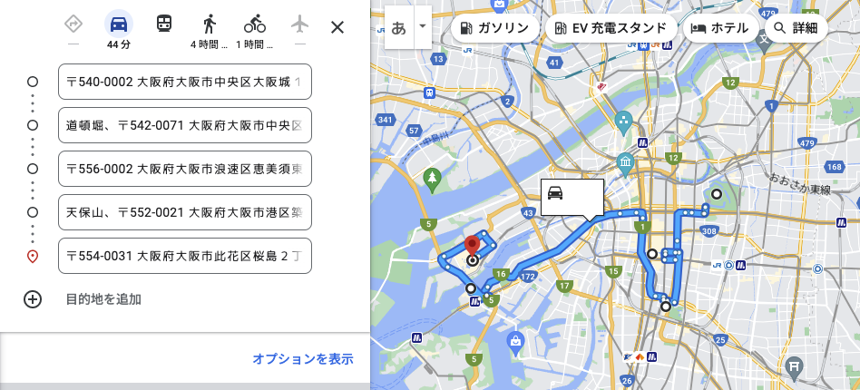
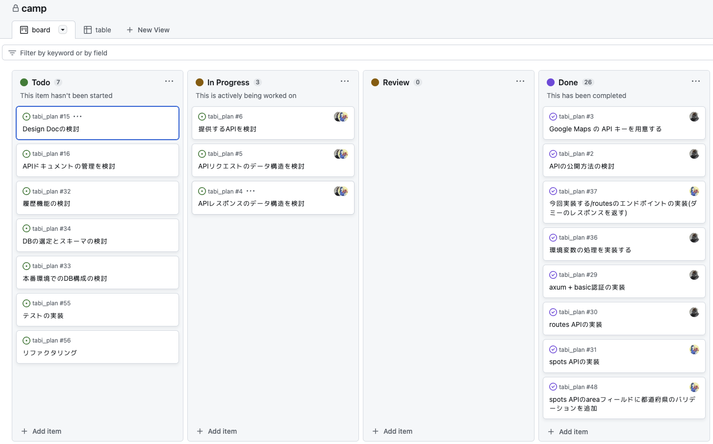

---
head:
  - - meta
    - name: twitter:card
      content: summary
  - - meta
    - property: og:site_name
      content: This Week in Gorilla
  - - meta
    - property: og:image
      content: https://i.gyazo.com/3d49fe20817a85d3cf7642fca4581e96.png
  - - meta
    - property: og:title
      content: 開発合宿の感想(2023/06/03~04)
---

# 開発合宿の感想(2023/06/03~04)


## はじめに
普段仲良くさせてもらっているエンジニア達と1泊2日（土日）の開発合宿をしたのでその感想を書いていく。

- https://twitter.com/Travelingcreat1
- https://twitter.com/megumish_unsafe
- https://twitter.com/fruscianteee
- https://twitter.com/nullmknexce （駆け出しエンジニアなので見学という形で参加）

## 合宿の流れ
合宿を企画するときにやったことをざーっとまとめると次のとおり。
一人あたりの予算は大体1万円くらい。

1. 合宿のテーマ決め
2. 人集め
3. チーム分け
4. 宿探し
   - 今回はairbnbで都内近辺にある3階建て一棟のビルを借りた
   - 一人あたり大体7000くらい
4. 各チーム内で合宿当日までに色々と事前準備をする（詳細は後述）
5. 合宿本番
   - 実装&発表
6. 解散

## 合宿のテーマ
動くものを作ったほうが充実感があるだろうし、お互い発表したら面白いだろうと思って、
参加者をチームに分けてRustを使って1日で何かしらを作ってそれを発表するという1日ハッカソンみたいなやつにした。  
※ハッカソンよくわかっていないので雰囲気で言っているが、まぁそんな感じのやつ。

## チーム
- ゴリラチーム
  - ゴリラ
  - Travelingcreat1 
- めぐチーム
  - megumish_unsafe
  - fruscianteee

## 作ったもの
ゴリラチームでは旅行に関するAPIを作った。「たびぷらん」と名付けた。
具体的に今回は次の2つAPIを作った。

- 都道府県からおすすめの観光スポットを提供するAPI
- 観光スポットを最短で巡るルートを提供するAPI

使い方はこんな感じ。

```sh
# おすすめの観光スポットを取得する
$ curl -s -u gorilla:gorillawjih -X POST -H "Content-Type: application/json" https://tabiplan-skanehira.cloud.okteto.net/spots -d '{ "area": "大阪府", "candidate_count": 5 }' | jq
{
  "places": [
    "大阪城",
    "道頓堀",
    "通天閣",
    "天保山",
    "海遊館"
  ]
}

# 最短ルートを取得
$ curl -s -u gorilla:gorilla -X POST -H "Content-Type: application/json" https://tabiplan-skanehira.cloud.okteto.net/routes -d '{ "origin": "大阪城", "destination": "USJ", "waypoints": [ "道頓堀", "通天閣", "天保山" ], "travel_mode": "driving" }' | jq -r .google_map_url         
https://www.google.com/maps/dir/?api=1&origin=1-1 Ōsakajō, Chuo Ward, Osaka, 540-0002, Japan&destination=2-chōme-1-33 Sakurajima, Konohana Ward, Osaka, 554-0031, Japan&waypoints=1 Chome-9 Dotonbori, Chuo Ward, Osaka, 542-0071, Japan|1-chōme-18-6 Ebisuhigashi, Naniwa Ward, Osaka, 556-0002, Japan|Mount Tenpō, 3 Chome-2 Chikko, Minato Ward, Osaka, 552-0021, Japan&travelmode=driving
```

最短ルートAPIから帰ってくるURLをそのまま開くと次のようにルートが表示される。



## 事前準備と合宿当日
5月に企画諸々決まったので、合宿本番まで約1ヶ月ほどあった。
なので、ゴリラチームでは事前に以下のことをやっていた。

- 作るものを決める
- 機能のスコープ決め
- 使用する技術の調査と選定
- ベース実装の用意

毎週火曜日夜に集まって、上記のことを会話しながら調査結果の確認や困っていることの相談など、色々やっていた。
基本的に当日は手を動かすだけの状態まで持っていくのをゴールとした。

ちなみに、これらをGitHubのプロジェクトを作って課題や進捗を管理していた。



個人的に記憶の残った内容を書いていく。

### 本番環境の用意

発表するときに実際にAPIを触れる環境を用意したいと思っていたので、自分がOracle Cloudのインスタンスを1つ持っていたのでビルドしたバイナリをそこで動かせばいいかなと最初考えていた。
しかしFWに穴を空けるしTLSどうするの？といった課題があった。

そこで[ngrok](https://ngrok.com)を使えばローカルサーバーにトンネルを張って安全にAPIを公開できるという情報を教えてもらった。
実際に触ってみると本当にサクっと動かせた。これに結構感動した。

ただ、最終的にngrokを使わず[Okteto](https://www.okteto.com)というk8sのマネージドサービスを使ってk8sクラスタにデプロイすることにした。
せっかく合宿やるからちょっとチャレンジしたいのと、一度はk8sで簡単なものをデプロイして公開するのを体験してみたかったというモチベがあったから。
そして、Oktetoは無料枠ならPod10個、メモリ6GB、ストレージ5GBも使える。今回の用途では十分だった。

Oktetoを触る際にあおいさんの[記事](https://zenn.dev/aoi/articles/9ff83fe3c2e58d)を大いに参考にさせてもらった。ありがたい。

ちなみにOktetoはserviceに`dev.okteto.com/auto-ingress: "true"`を書けばエンドポイントが生えてくるので、そこにリクエストを送ればLBに渡ってPodに転送されるようになるのでとても便利だった。

```yaml{8}
apiVersion: v1
kind: Service
metadata:
  name: tabiplan
  labels:
    app: tabiplan
  annotations:
    dev.okteto.com/auto-ingress: "true"
spec:
  type: LoadBalancer
  ports:
    - port: 8080
      protocol: TCP
      targetPort: 8080
  selector:
    app: tabiplan
```

あと、k8sにデプロイするイメージのDockerfileは次のものを用意した。
Oktetoはレジストリを持っているので、`okteto build`すれば自動でレジストリにアップロードまでやってくれる。

ちなみに、ビルドキャッシュを効かせるため`--mount=type=cache`を使ったが、これの存在を知らなかったので良い勉強になった。

```Dockerfile
# syntax=docker/dockerfile:1
FROM rust:1.69 as builder
WORKDIR /app
COPY . .
RUN --mount=type=cache,target=/usr/local/cargo/registry \
    --mount=type=cache,target=/app/target \
    touch /app/src/main.rs && cargo build --release && mv target/release/tabi_plan /tabi_plan
FROM gcr.io/distroless/cc:latest
COPY --from=builder /tabi_plan /tabi_plan
ENTRYPOINT ["/tabi_plan"]
```

### 認証

触れるAPIを公開するのであれば、レートリミットか認証を用意しないといけないので、keycloakまたは既存のマネージドサービスを使うかで検討していた。

ちょうどその頃[catnoseさん](https://twitter.com/catnose99)が[未ログインでも叩けるAPIエンドポイントにレートリミットを導入する](https://zenn.dev/catnose99/articles/9183c86d3558e5)という記事を公開していたので、それを参考にしようとした。

ただ、個人的にkeycloakでOIDCを使いたいなと思っていた。
こちらもやったことがなくてチャレンジしてみたいというモチベだった。

最終的にTravelingcreat1からBasicはどう？って提案されて、たしかに今回の規模ならbasicで一旦いいかと思ってその方針とした。
余談だけど、OIDCの復習をした際に、次の記事を読み返した。最高にわかりやすかった。

- [一番分かりやすい OAuth の説明](https://qiita.com/TakahikoKawasaki/items/e37caf50776e00e733be)
- [一番分かりやすい OpenID Connect の説明](https://qiita.com/TakahikoKawasaki/items/498ca08bbfcc341691fe)

Basic認証の実装の調査に関しては、Travelingcreat1がやってくれた。
APIサーバーはaxumで実装していて、最終的に以下の実装になった。

```rust
pub async fn auth_middleware<B>(
    State(state): State<Arc<AppState>>,
    req: Request<B>,
    next: Next<B>,
) -> Response {
    let (mut parts, body) = req.into_parts();

    let auth = parts.extract::<TypedHeader<Authorization<Basic>>>().await;
    match auth {
        Ok(auth) => {
            if auth.username() != state.config.basic.user_name
                || auth.password() != state.config.basic.password
            {
                // invalid user
                unauthorized!();
            }
        }
        Err(e) => {
            // no auth header
            eprintln!("{}", e);
            unauthorized!();
        }
    }

    let req = Request::from_parts(parts, body);
    next.run(req).await
}
```

個人的に`parts.extract::<TypedHeader<Authorization<Basic>>>()`の実装が結構面白かった。
`parts.extract<E<T<C>>>()`はHTTPリクエストのヘッダーの値を取り出すときに使うのだけど、ジェネリクスになっていて、型を注入してあげることによって実装を切り替える感じになっている。
雑に説明するとこんな感じでメソッドが呼ばれる。

`E::from_request_parts()` -> `T::decode()` -> `C::decode()`

Cは`Basic`以外に`Bearer`があるので、token認証系はそっちを使う感じになると思う。

### OpenAI API

今回実装した都道府県のおすすめの観光地スポットを提供するAPIは`OpenAI API`を使っている。
ちゃんと作るなら、レコメンデーションシステムを作ることになるのでかなり大変そうだったので、せっかくAIがあるからそれを使おうって話になった。
ちなみに、APIの実装とプロンプトの調査はほぼTravelingcreat1がやってくれた。

実装とプロンプトは最終的にこんな感じになった。JSONで返してもらうようにフォーマットを指定したり、JSON以外のデータが返ってきたりするので、
JSONパースエラーにならないようにワークアラウンドで誤魔化したりしている。

```rust
pub async fn get_spots(
    State(state): State<Arc<AppState>>,
    input: Json<Input>,
) -> Result<Json<Output>, AppError> {
    if !is_valid_prefecture(input.area.as_str()) {
        return Err(AppError(anyhow!("該当の都道府県は存在しません")));
    }
    let mut conversation = state
        .chat_gpt_client
        .new_conversation_directed("あなたは日本旅行の素晴らしいプランナーです。");
    let content = format!(
        "都道府県である{}のおすすめの観光名所を合計{}個教えてください。レスポンスは次のJSON形式で返してください。JSON以外の説明は不要です。\
        {{\"places\": [\"\"]}}\
        存在しない都道府県の入力があった場合もしくは候補地がない場合は以下のJSONのみを返してください。JSON以外の説明文は不要です\
        {{\"places\": []}}",
        input.area, input.candidate_count
    );
    let response = conversation.send_message(content).await?;
    let message = response.message().content.to_string();
    if message.contains("{\"places\": []}") {
        return Err(AppError(anyhow!("該当の都道府県は存在しません")));
    }
    let output: Output = serde_json::from_str(message.as_str())?;
    Ok(Json(output))
}
```

### Google Map API

受け取ったスポットから最短ルートを提供するAPIはGoogle Map APIを使った。
こちらは事前調査で巡回セールスマンのアルゴリズムを使えば最短ルートを出せるとわかっていたが、肝心の距離のデータをどうするのかって問題があった。
そういった距離のデータはGoogle Map APIから取れるだろうと思ってドキュメントを漁ったら普通に計算してくれるAPIが用意されていたので、割とサクっと実装できた。

こちらは自分が担当していて、実装はこんな感じ。

```rust
pub async fn get_routes(
    State(state): State<Arc<AppState>>,
    input: Json<Input>,
) -> Result<Json<Output>, AppError> {
    let travel_mode = input.travel_mode.to_string();
    let url = Url::parse_with_params(
        &state.config.google_map.google_map_endpoint,
        &[
            ("origin", &input.origin),
            ("destination", &input.destination),
            ("waypoints", &input.waypoints.join("|")),
            ("mode", &travel_mode),
            ("key", &state.config.google_map.google_map_api_key),
        ],
    )?;

    let req = state.google_map_client.get(url);
    let dirs: Directions = req.send().await?.json().await?;

    let legs = &dirs.routes[0].legs;
    let origin = &legs[0].start_address;
    let destination = &legs[legs.len() - 1].end_address;
    let waypoints = legs[0..legs.len() - 1]
        .iter()
        .map(|leg| leg.end_address.clone())
        .collect::<Vec<_>>()
        .join("|");

    let url = format!(
        "https://www.google.com/maps/dir/?api=1&origin={}&destination={}&waypoints={}&travelmode={}",
        origin, destination, waypoints, travel_mode
    );

    let resp = Output {
        google_map_url: url,
    };
    Ok(Json(resp))
}
```

### シークレット

k8sにアプリを乗せる際にトークンをセキュアに扱うかという課題があった。
シークレットは平文で保存されるため、基本的にトークンをそこに入れるのはどうなの？と思っていたが、[kahirokunn](https://twitter.com/kahirokunn)に[RBAC](https://kubernetes.io/ja/docs/reference/access-authn-authz/rbac/)を使うと良いよと教えてもらった。

RBACはサービスアカウントのk8s APIへのアクセスを制御するできる機能らしく、Podとサービスアカウントを紐づけるとPodからk8s APIへのアクセスを制御できるらしい。
これを使って適切なアクセス制御を行うことが一般的とのこと。
またトークンの作成や管理はexternal secret operator(AWS Secret Managerなど)を使ってやることが一般的とのこと。

今回はOpenAIとGoogle Map APIを使うので、本来なら定期的にoperatorを使ってトークンをローテーションさせつつ、RBACを使って特定のPodからアクセスできるように制御すべきだと思うが、
時間がなかったので一旦シークレットの次のマニフェストを書いてそのままapplyした。

```yaml
apiVersion: v1
kind: Secret
metadata:
  name: basic-auth
type: kubernetes.io/basic-auth
stringData:
  username: ***
  password: ***

---

apiVersion: v1
kind: Secret
metadata:
  name: open-chat-api
type: Opaque
stringData:
  token: ***

---

apiVersion: v1
kind: Secret
metadata:
  name: google-map-api
type: Opaque
stringData:
  token: ***
```

```yaml
    ...
    spec:
      containers:
      - name: tabiplan
        image: okteto.dev/tabiplan:latest
        ports:
          - containerPort: 8080
        env:
          # basic 認証
          - name: BASIC_USER
            valueFrom:
              secretKeyRef:
                name: basic-auth
                key: username
          - name: BASIC_PASSWORD
            valueFrom:
              secretKeyRef:
                name: basic-auth
                key: password
          # Open Chat API
          - name: OPEN_CHAT_ENDPOINT
            value: https://api.openai.com/v1/chat/completions
          - name: OPEN_CHAT_API_KEY
            valueFrom:
              secretKeyRef:
                name: open-chat-api
                key: token
          # Google Map API
          - name: GOOGLE_MAP_ENDPOINT
            value: https://maps.googleapis.com/maps/api/directions/json
          - name: GOOGLE_MAP_API_KEY
            valueFrom:
              secretKeyRef:
                name: google-map-api
                key: token

```

勉強の一環でOpenAIのexternal secret operatorを作っても面白そうなので、残課題として今後やってみたいなと思う。

## まとめ
今回開発合宿を企画したのは2回目で、ハッカソン的感じでやったのは初めてだった。
不安はあったけど、ちゃんと事前準備をしっかりやった上で、当日も予定通りAPIを完成できてよかったし楽しかった。
k8sも触れたし、Rustも書けたし、概ね満足している。

個人的に「事前準備も含めて合宿」だなぁと感じたので、今後もこのスタイルでやっていこうと思っている。
今年中にもう一回合宿をやろうかな。
